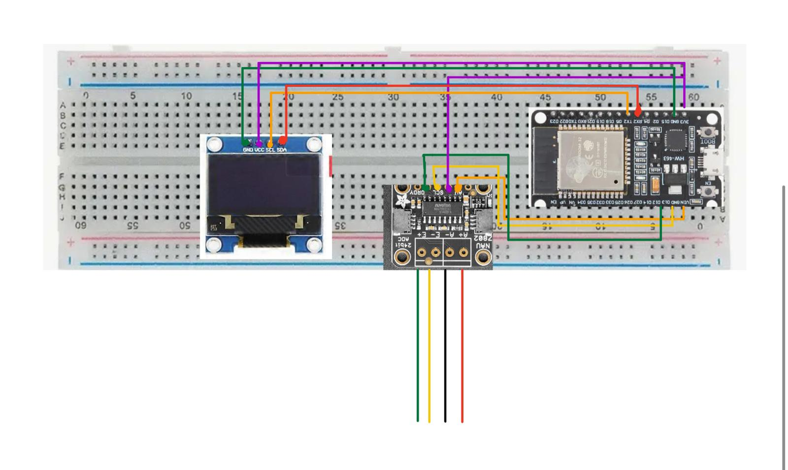
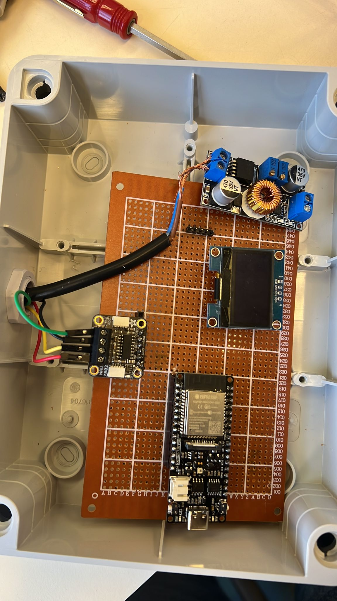

## Precision Plant Watering System

**Project Overview**

Integrated Arduino-based platform combining precision weight measurement and automated irrigation management for advanced agricultural technology.

**Key Components**

Load cell weight measurement system
Sensor-driven irrigation control
Real-time data monitoring and display
Compact, adaptable design for agricultural applications

**System Capabilities**

Precise weight tracking
OLED display for instant feedback
Configurable sensor parameters for diverse agricultural environments

**Technical Innovation**
Merges high-precision sensing technologies to provide   real-time insights into crop weight,and irrigation needs, enabling data-driven agricultural management.
Core Functionalities

**Continuous weight measurement**

Sensor calibration
Automated irrigation response
User-friendly digital interface

